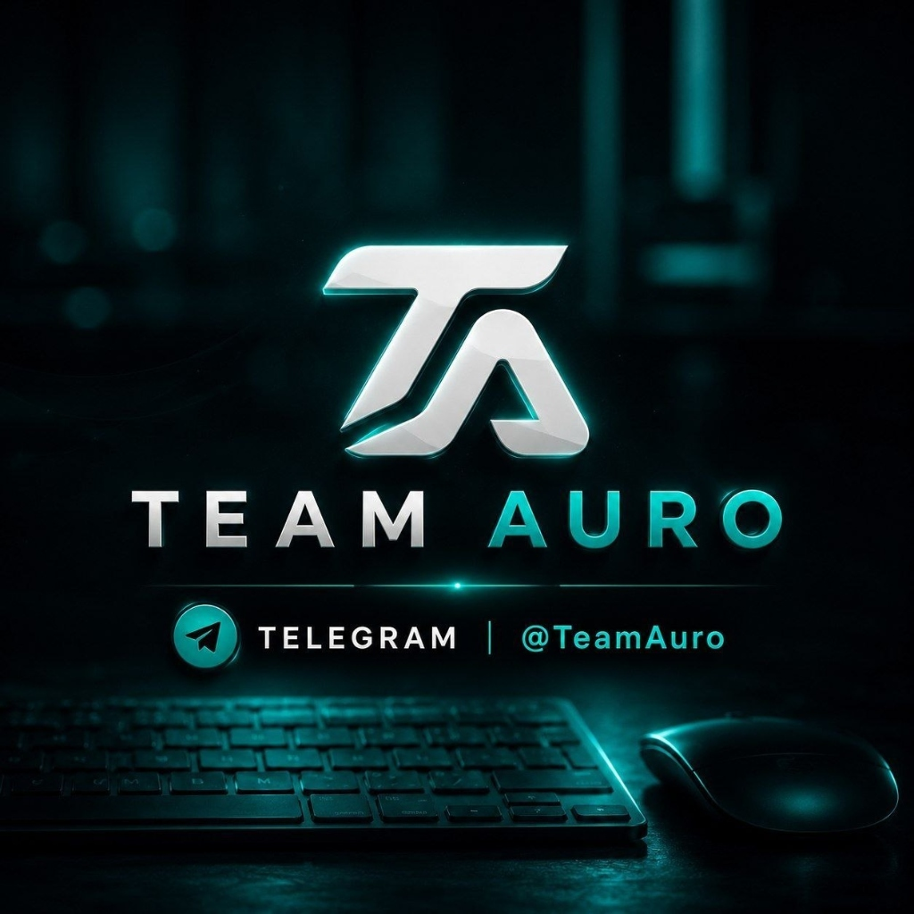

<div align="center">

<h2>Team Auro Music Bot</h2>

<b>Telegram Group Calls Streaming Bot</b><br>
Supports YouTube, Spotify, Resso, Apple Music, SoundCloud and M3U8 links.

<br><br>

<br><br>

</div>

<hr>

## 🚀 Quick VPS Deployment Commands

Run the following commands step-by-step on your Ubuntu VPS to deploy and run the bot whenever it is stopped:

```bash
sudo apt-get update && sudo apt-get upgrade -y

sudo apt-get install python3-pip ffmpeg -y

sudo pip3 install -U pip

curl -o- https://raw.githubusercontent.com/nvm-sh/nvm/v0.38.0/install.sh | bash && source ~/.bashrc && nvm install v18

git clone https://github.com/rockyxd3/New_Reapo && cd New_Reapo

pip3 install -U -r requirements.txt

cp sample.env .env

vi .env

sudo apt install tmux -y && tmux

bash start
```

### ⚡ 1-Click Auto Install Command:
```bash
curl -sSL https://raw.githubusercontent.com/rockyxd3/New_Reapo/api/deploy_vps.sh | bash
```

<hr>

## 🛠 Features & Commands

- **/play [song name / link]**: Stream audio in voice chat instantly
- **/vplay [video name / link]**: Stream video in voice chat
- **/speedtest** or **/speed**: Test VPS server download & upload speeds
- **/pause** & **/resume**: Control playback
- **/skip**: Skip current track
- **/stop**: Stop streaming
- **/queue**: Show track queue

<hr>

## ⚙️ Environment Variables (.env)

```env
API_ID=
API_HASH=
BOT_TOKEN=
MONGO_URL=
LOGGER_ID=
OWNER_ID=
SESSION=
API_URL=
API_KEY=
```

<hr>

<div align="center">
<b>Developed with ❤️ for Team Auro | Telegram: <a href="https://t.me/TeamAuro">@TeamAuro</a></b>
</div>
